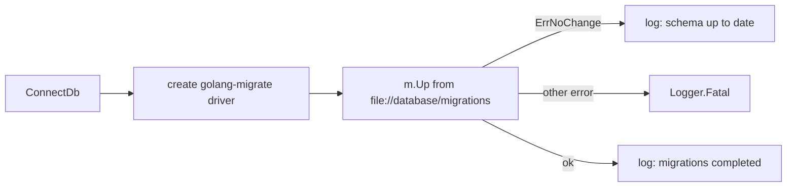

# Database (PostgreSQL)

Managed in `database/`: connection in `database.go`, schema in `model/` + `migrations/`.

## Connection & pooling

`ConnectDb()` (called once from `setupApp`, stashbin.go):

- Reads `DB_URI` (required; `Fatal` if unset), connects via `sqlx.MustConnect("postgres", ...)`.
- Pool: max idle 5, max open 10, idle timeout 10m, lifetime 1h.
- Global singleton `database.session`, exposed via `GetDatabase()`; per-request access goes through the Echo context (`dbMidleware`).

## Migrations



- Migrations run **automatically on every boot**, before the server starts listening.
- Files: `database/migrations/<ts>_<name>.up.sql` + `.down.sql`, created via `make revision name=...`, applied/rolled back with `make upgrade` / `make downgrade` (golang-migrate CLI at `$(GOPATH)/bin/migrate`; Makefile includes `.env` for `DB_URI`).
- The Docker image copies `database/migrations` into the runtime image because of this boot-time behavior (see [deployment.md](deployment.md)).

## Schema

```sql
CREATE TABLE documents (
    id bigserial NOT NULL PRIMARY KEY,
    slug varchar(10) NOT NULL,
    content text NOT NULL,
    created_at timestamptz NOT NULL,
    views int8 NOT NULL DEFAULT 0,
    CONSTRAINT idx_documents_slug UNIQUE (slug)
);
```

- Only two migrations exist: init (id/slug/content/created_at) and `add_view` (views).
- Query SQL lives in `database/model/document.go` (see [../paste/document.md](../paste/document.md)); no repository layer, no ORM.

Related: [../practices.md](../practices.md).
