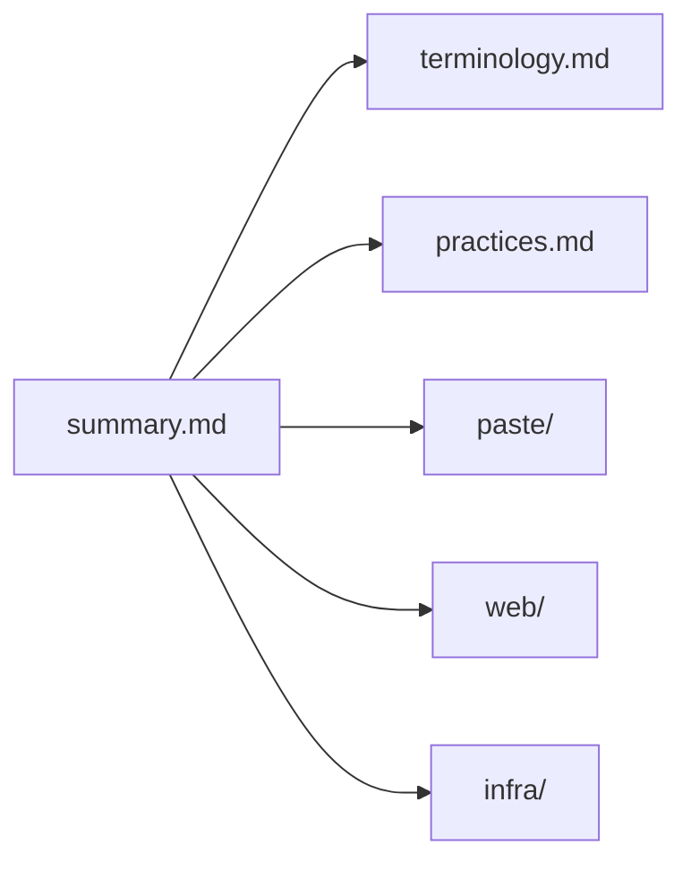

# Lode Map

Index of all lode files. Keep in sync when files are added/moved.

## Root

- [summary.md](summary.md) — one-paragraph living snapshot of the project
- [terminology.md](terminology.md) — domain language (Document, Slug, Raw, ...)
- [practices.md](practices.md) — code conventions, tooling commands, middleware order
- [plans/](plans/) — roadmaps & TODOs (currently empty)

## paste/ — core domain

- [paste/summary.md](paste/summary.md) — domain overview
- [paste/document.md](paste/document.md) — Document entity: creation, slug generation, view counting

## web/ — HTTP surface & UI

- [web/summary.md](web/summary.md) — web layer overview
- [web/http-api.md](web/http-api.md) — routes, API contracts, htmx handling, middleware
- [web/frontend.md](web/frontend.md) — templ views, htmx save flow, Tailwind build

## infra/ — platform

- [infra/summary.md](infra/summary.md) — infra overview
- [infra/database.md](infra/database.md) — PostgreSQL connection, schema, migrations
- [infra/deployment.md](infra/deployment.md) — Docker, compose, env vars, metrics server

## tmp/

Session scraps, git-ignored. Not indexed.
