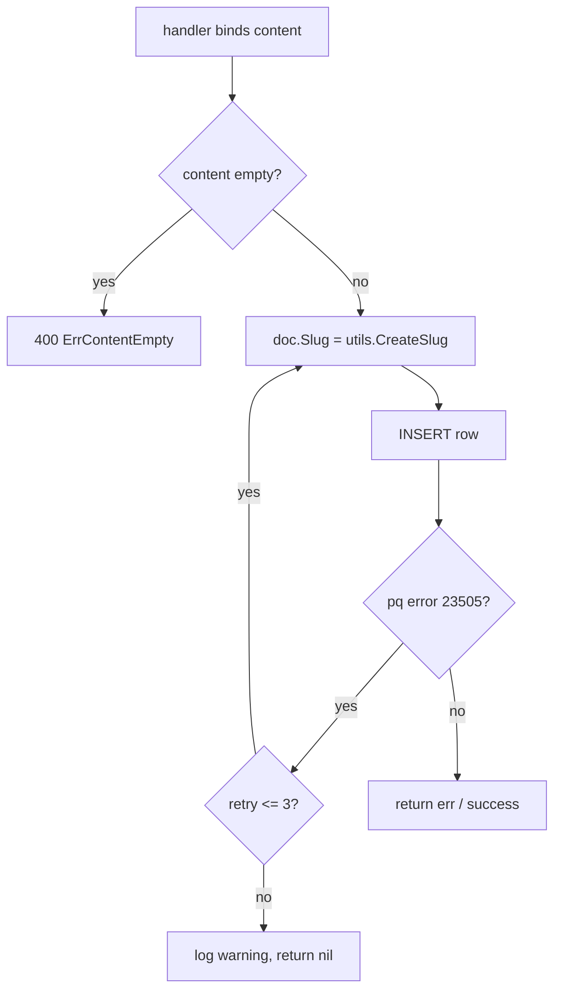

# Document Entity

Defined in `database/model/document.go`. One row in `documents`.

```go
type Document struct {
    Slug      string    `json:"key"`
    Content   string    `json:"content" form:"content"`
    CreatedAt time.Time `json:"date"`
    Views     uint      `json:"views"`
}
```

## Creation (`Create` → `insertDocument`)



Invariants & quirks:

- Slug: 10 chars from `[a-z]` via `utils.CreateSlug()` (`utils/slug.go`), regenerated on every retry.
- **Known quirk:** when retries exceed 3, `insertDocument` logs a warning and returns `nil` — the handler then reports success (`201`) without a row being created. Treat as a latent bug, not intended behavior.
- `CreatedAt` is set server-side at insert time; clients can't forge it.
- Content has no size/type validation at the model layer; only non-empty at the handler.

## Read (`GetBySlug`) & view counting

```go
err := db.QueryRowx("SELECT slug, content, created_at, views FROM documents WHERE slug = $1 LIMIT 1", slug).Scan(...)
go doc.incrementViews(db) // fire-and-forget
```

- View increment runs in a detached goroutine (`go doc.incrementViews(db)`) so reads stay fast; the `UPDATE ... SET views = views + 1` runs in its own transaction.
- Because it is detached, the view count shown on the just-loaded page is always one behind; acceptable for this product.
- `incrementViews` swallows errors (rollback or commit via defer, errors only logged).

Related: [../infra/database.md](../infra/database.md), [../web/http-api.md](../web/http-api.md).
