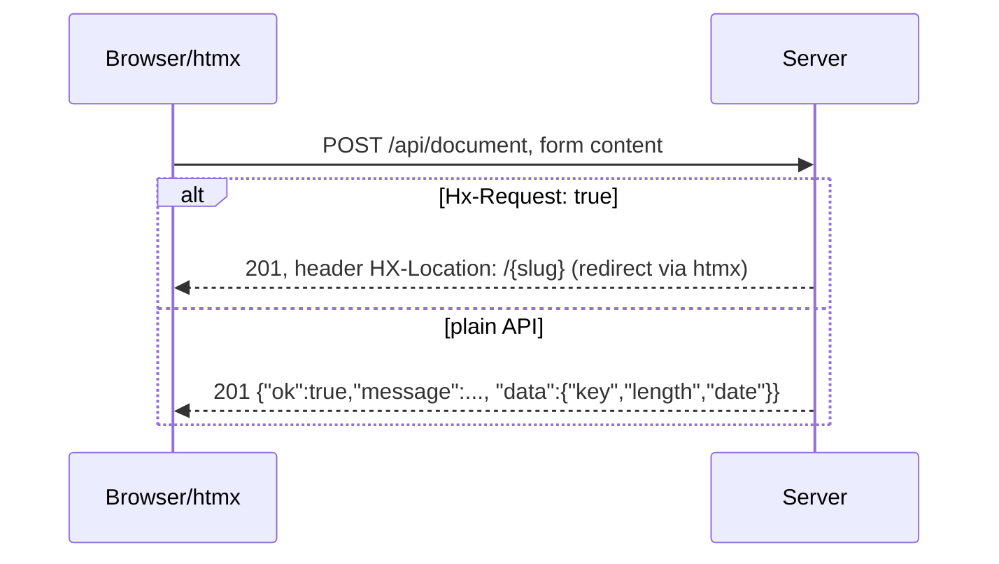

# HTTP API & Routing

All routes are registered in `stashbin.go` (`setupApp` + `main`). Handlers live in `handler/api` and `handler/page`.

## Routes

| Method | Path | Handler | Notes |
|---|---|---|---|
| GET | `/` | `page.HomeHandler` | editor page |
| GET | `/about` | `page.AboutHandler` | static about page |
| GET | `/:slug` | `page.DocumentPageHandler` | renders paste; `307 → /` if slug unknown |
| GET | `/raw/:slug` | `page.RawPageHandler` | `text/plain` body; `307 → /` if unknown |
| GET | `/health` | `api.HealthCheck` | `{"message":"ok"}` (no DB check) |
| POST | `/api/document` | `api.CreateDocument` | form body `content=...` |
| GET | `/api/document?key=` | `api.GetDocumentBySlug` | JSON with content |
| GET | `/assets/*`, `/images/*` | static | from `./public/` |
| GET | `/favicon.ico`, `/manifest.json`, `/robots.txt`, `/sitemap.xml` | files | from `./public/` |

## POST /api/document contract

- Non-empty `content` enforced → `400 ErrContentEmpty`; bad body → `400 ErrInvalidBody`; DB failure → `500`.
- The htmx branch returns an empty 201 body — htmx client-side follows `HX-Location`.

## GET /api/document contract

- Missing `key` query param → `400 ErrNoKeyQuery`; unknown slug → `404 ErrDocumentNotFound`.
- Success → `{"ok":true,"message":...,"data":{"content":...}}` (no key/views in the response).

## Cross-cutting middleware

- Rate limit: in-memory, 50 requests (global, all routes).
- Trailing slashes removed (Pre), panic recovery (Pre).
- Metrics middleware skips: `/assets`, `/images`, `/manifest.json`, `/robots.txt`, `/sitemap.xml`, `/metrics`, `/health`.
- Every handler receives `"db"` (*sqlx.DB) from context (see [../practices.md](../practices.md)).

Quirks:

- `/:slug` matches any single path segment, so unknown top-level paths render the "not found" page flow rather than a real 404 — they 307-redirect to `/` (see `handler/page/document.go`).
- `PostgreErrToResponse` in `utils/response` exists but handlers don't use it consistently; error mapping is manual per-handler.

Related: [document.md](../paste/document.md), [frontend.md](frontend.md).
